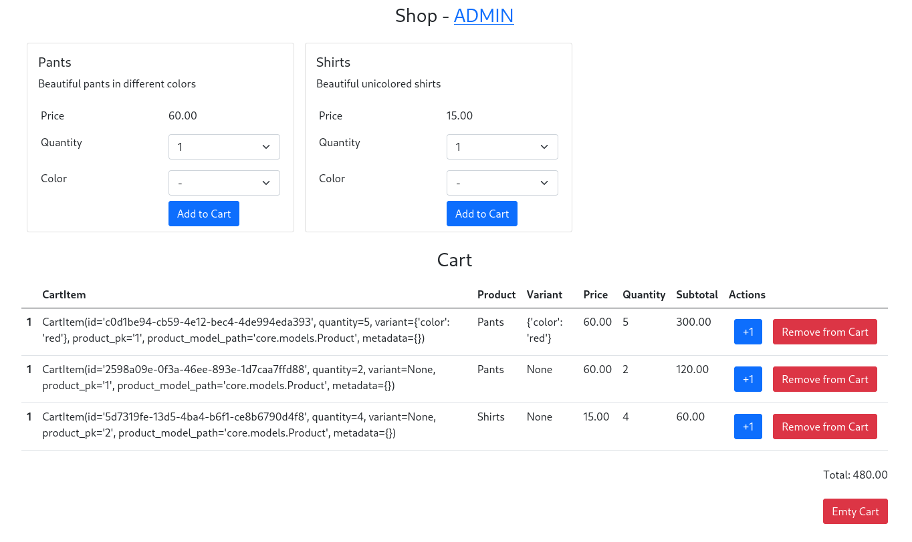

# An example of a cart 

An example of a cart with Products and ProductVariates.

## Initial setup

```
python3 -m venv venv
python3 -m venv venv
pip install dj-shop-cart

python manage.py migrate
python manage.py loaddata core
python manage.py runserver
```

